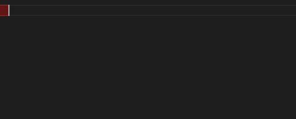

EN | [JA](/README.ja.md)

[](LICENSE)
[](https://hub.docker.com/layers/library/python/3.9/images/sha256-c65dadac8789fed40962578392e99a0528dcb868442c75d144e68ba858984837?context=explore)
[](https://github.com/44103/awschains/actions/workflows/test.yml)

---

# AWS Chains

AWS Chains is a wrapper for writing boto3 as method chain.

## DynamoChain

### How to Use

1. Query to DynamoDB
   ```python
   result = (
       Query(table)
       .partition_key_exp(Key("ForumName").eq("Amazon S3"))
       .sort_key_exp(Key("Subject").gte("S3 Thread 2"))
       .filter_exp(Attr("LastPostedBy").eq("User A"))
       .filter_exp(Attr("Views").eq(1))
       .projection_exp("ForumName, Subject, Message")
       .projection_exp("LastPostedBy, LastPostedDateTime, Views")
       .desc()
       .run()
   )
   ```

### Signature Feature

#### Code Completion


